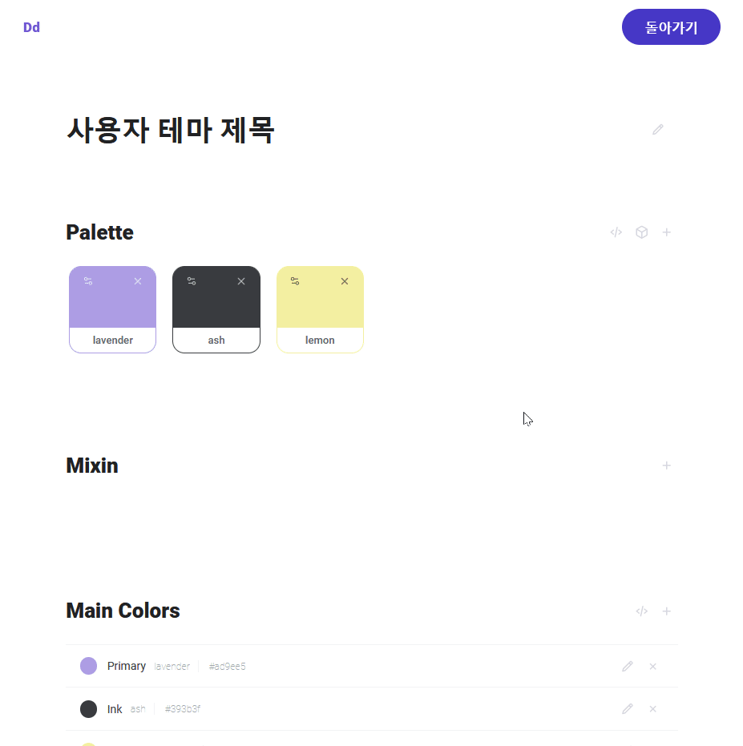
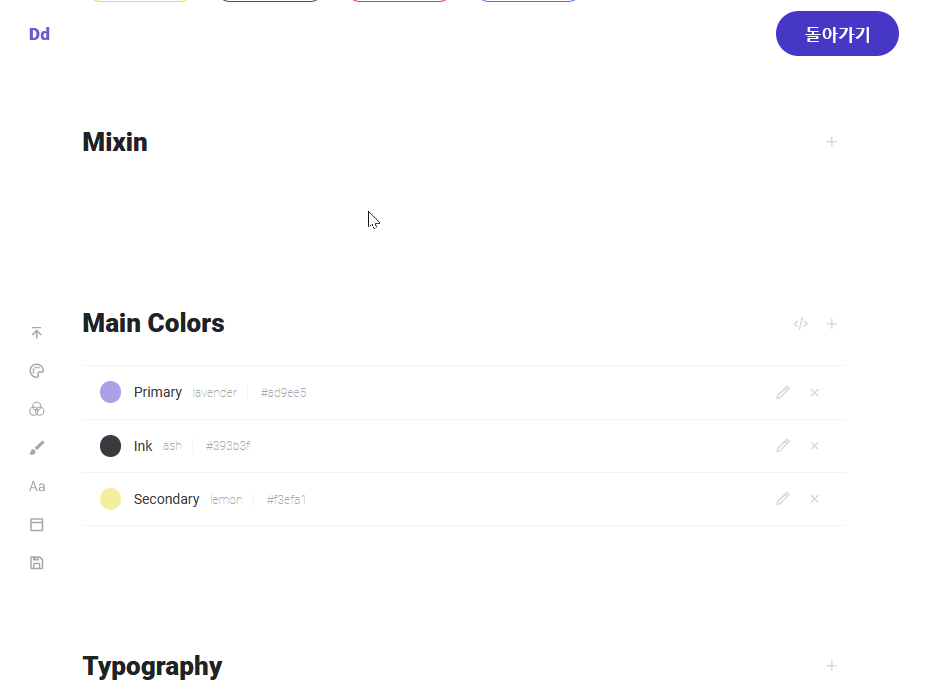
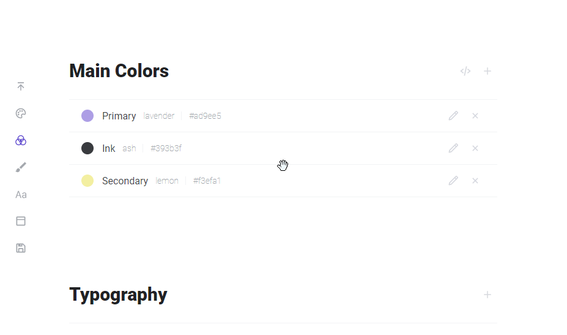
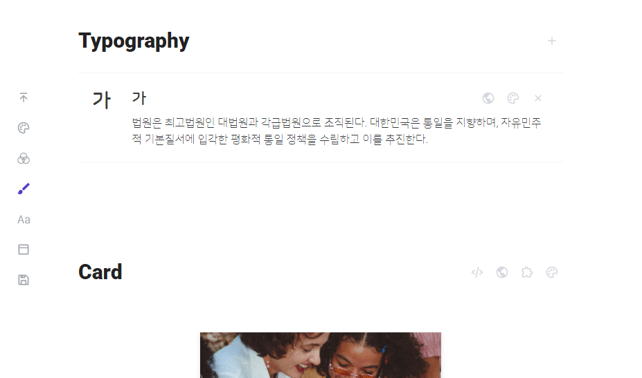
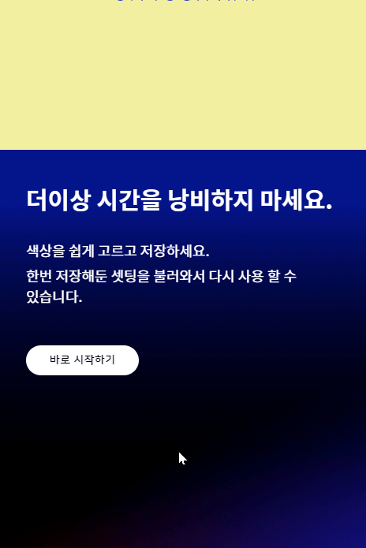
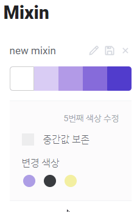

# 목적

디자인 시스템을 색상을 위주로 하여 만들 수 있다.

[사용해보기](https://serene-gates-31a447.netlify.app/)

# 기획

## 작업 기간

- 21.04.01 ~ 21.04.22 (총 3주)
- 1인 프로젝트

## 사용 스택 & 주요 라이브러리

- React.js
- mobx
- styled-components
- react-router-dom
- react-beautiful-dnd
- react-syntax-highlighter
- react-select

## 주요 기능

### parallax 랜딩 페이지


### 색상 추가, 수정, 드래그 & 드랍



- **색상을 선택**하거나 **랜덤으로 생성**할 수 있다.
- 만든 색상의 이름이나 색상을 수정, 삭제 할 수 있다.
- 색상의 hex를 **간단하게 복사**할 수 있다.
- **드래그 & 드랍**으로 순서를 변경할 수 있다.

### 색상 섞기



- `palette`에 있는 색상끼리 섞어서 새로운 색상을 만들 수 있다.
- `mixin`에 저장한 이름으로 `palette`에 저장할 수 있다.

### 카드, 버튼 디자인 기능(정해진 옵션 내에서)


- 카드의 셋팅을 **실시간으로 수정**할 수 있다.
- `palette`에 있는 색상으로 옵션을 꾸밀 수 있다.
- 만든 카드의 셋팅의 **코드를 실시간으로** 볼 수 있다.
- 버튼 색상의 명도에 따라 버튼의 글자색이 흰색과 검정색으로 바뀐다.

### 그외

#### 저장

설정한 옵션들을 로컬스토리지에 저장하며, 재방문 시 옵션을 가져온다.

#### Main Colors

`palette`에 있는 색상의 역할을 지정할 수 있다.



#### Typography

`palette`에 있는 색상을 선택하여 글자색으로 확인할 수 있다.



# 주요 코드

## mobx를 이용한 상태관리

설정한 옵션들을 로컬스토리지에 저장하고, 가져올 수 있다.
[전체 코드](https://github.com/mochapoke/design-system/blob/main/src/Store/BaseColorStore.jsx)

```js
  saveList() {
    const baseColorList = this.baseColorList.map((item) => ({
      hexId: item.hexId,
      label: item.label,
      role: item.role,
    }));
    localStorage.setItem('baseColorList', JSON.stringify(baseColorList));
  }

  loadList() {
    const list = localStorage.getItem('baseColorList');
    const dataList = JSON.parse(list);
    if (!dataList) return;

    this.clearList();
    for (let i = 0; i < dataList.length; i++) {
      const { role, label, hexId } = dataList[i];
      this.addNewBaseColor(hexId, label, role);
    }
  }
```

## landing page의 특정 요소가 화면에 붙는 코드



parallex effect의 기본개념을 활용하여 작성함.
`window.scrollY`의 값이 특정 구간일 때만 `position: fixed`가 되게 하기 위해, `isSticky`라는 변수를 이용하여 className으로 속성을 변경하였다.
또한 `visibility`라는 변수를 만들어서 자연스럽게 사라지는 효과를 주었다.
`visibility`라는 변수가 없을 경우, 자연스럽게 사라지지않고 뚝 없어진다.

```js
const Section3 = ({ history }) => {
  const [isSticky, setIsSticky] = useState(false);
  const [visibility, setvisibility] = useState(true);

  const onSticky = () => {
    let offset = window.scrollY;
    let height = window.innerHeight;
    if (offset < height * 2) setIsSticky(false);
    if (offset >= height * 2) setIsSticky(true);
    if (offset > height * 3) setIsSticky(false);
    if (offset > height * 2.7) setvisibility(false);
    if (offset <= height * 2.7) setvisibility(true);
  };

  useEffect(() => {
    window.addEventListener('scroll', onSticky);
    return () => {
      window.removeEventListener('scroll', onSticky);
    };
  }, []);

  return (
    <BasicContainer>
      <TitleContainer
        className={`${isSticky && 'fixed'}`}
        style={{ opacity: visibility ? 1 : 0 }}
      >
        <BlueGradation />
        <MainTitle small>
          <span>더이상 시간을 낭비하지 마세요.</span>
        </MainTitle>
        <SubText subSmall>
          <span>색상을 쉽게 고르고 저장하세요.</span>
          <span>한번 저장해둔 셋팅을 불러와서 다시 사용 할 수 있습니다.</span>
        </SubText>
        <Button primary onClick={() => history.push('/main')}>
          바로 시작하기
        </Button>
      </TitleContainer>
    </BasicContainer>
  );
};
```

스타일드 컴포넌트의 코드.

```js
export const TitleContainer = styled.div`
  position: relative;
  padding: 2rem;
  display: flex;
  flex-direction: column;
  align-items: flex-start;
  justify-content: flex-start;
  width: 100%;
  height: 100%;
  transition: opacity 0.5s ease;
  overflow: hidden;

  &.fixed {
    position: fixed;
    top: 0;
    z-index: 10;

    @media screen and (min-width: 768px) {
      top: 80px;
    }
  }
`;
```

## 관리하기 편하게...

반복하여 사용하는 컴포넌트가 있을 경우, 관리하기 쉽게 따로 상수로 빼놓았다.

```js
const SELECT_LIST = [
  { label: '제목 색상', value: 'headColor' },
  { label: '내용 색상', value: 'contentColor' },
  { label: '버튼 색상', value: 'buttonColor' },
];

const SLIDER_LIST = [
  { label: '버튼 라운드 값', name: 'buttonRadius' },
  { label: '카드 라운드 값', name: 'borderRadius' },
];

const SetColorsList = ({ isOpen }) => {
  return (
    <>
      {isOpen && (
        <OptionContainer>
          {SELECT_LIST.map((item) => (
            <SelectModule
              label={item.label}
              value={item.value}
              key={item.value}
            />
          ))}
          <SetButtonHover />
          {SLIDER_LIST.map((item) => (
            <CardSlider label={item.label} name={item.name} />
          ))}
        </OptionContainer>
      )}
    </>
  );
};
```

## Mixin의 옵션 관련

mixin의 option 창은 처음, 중간, 마지막의 색상만 열 수 있다.



### 옵션창 여닫기

`indexLog`라는 `stack`을 만들어, 클릭한 색상의 `index`를 기록했다.
`indexlog`와 다른 index일 경우 옵션창을 열었다.
색상을 선택했을 때 `indexLog`와 해당 색상의 `index`를 비교하여 같은 `index`일 경우 옵션창을 닫았다.

```js
const openOptions = (index) => {
  if (index === 1 || index === 3) return null;
  if (index !== indexLog) {
    setIndexLog(index);
    setIsOptionOpen(true);
  }
  if (index === indexLog) {
    setIndexLog('');
    setIsOptionOpen(false);
  }
};
```

### 특정 index에만 옵션 버튼이 나옴

목적은 처음, 중간, 마지막의 색상만 `옵션 버튼`이 나오는 것.

hover되었는지 확인하기 위해 onHover함수를 작성하였고, 요소의 index를 판단하여 특정 index일 경우에만 `isHover`를 `true`로 전달하였다.

```js
const SmallMixin = observer(({ smallColor, index, open }) => {
  const [isHover, setIsHover] = useState(false);
  // 아래 3줄은 커스텀 훅으로 만든 색상 관련 함수
  const { getColor, getBorderColor } = useContrast();
  const bordercolor = getBorderColor(smallColor);
  const buttonColor = getColor(smallColor);

  const onHover = (value) => {
    if (index === 1 || index === 3) return null;
    else setIsHover(value);
  };

  return (
    <ColorBox
      onMouseOver={() => onHover(true)}
      onMouseLeave={() => onHover(false)}
      hexId={smallColor}
      borderColor={bordercolor}
      onClick={() => open(index)}
    >
      <SmallButton
        mixin
        buttonColor={buttonColor}
        className={`${isHover && 'hover'}  mixin`}
        title='색상 수정하기'
      >
        <CgOptions />
      </SmallButton>
    </ColorBox>
  );
});
```

# 문제 해결 경험

## 모달의 z-index

### 첫번째 문제

`palette`메뉴에서 모달을 통해 색상과 색상의 이름을 수정함.

- `컬러칩 모듈` 컴포넌트 내에서 제일 윗줄에 모달 관련 코드를 작성함.
- 첫번째 `컬러칩 모듈` 컴포넌트의 모달은 그렇지 않지만, 나중에 작성한 컬러칩 모듈에서 생성된 모달일 수록 모달 내부가 투명해짐.
- `z-index`를 9999 로 주어도 해결이 되지 않음.

### 해결

`z-index`에 대해 다시 알아봄.

- 공부해보니 `z-index`는 부모요소에 관련을 받는거지, body기준에서의 `z-index`가 아니라는 것.
- 따라서 모듈 내부에 있던 모달은, 모듈들이 많아 질수록 z-index가 뒤로 밀려서 투명해 보일 수 밖에 없었던 것.
- 모달을 `palette` 모듈 내에 두지 않고 훨씬 상위 컴포넌트인 `color section`에 두었고, `mobx`로 모달의 열림과 닫힘을 관리하여 문제를 해결함.

### 두번째 문제

#### 원인

- 첫번째 문제를 해결하니, 하나의 모달에서 색상 추가와 수정을 관리해야함.
- 추가인지 수정인지를 모달 내에서 판별해야함.

#### 해결

- 전역상태관리 라이브러리인 `mobx`를 이용함.
- 색상을 수정하는 경우, 원본 색상 관련 정보를 `payload`로 전달함.
- 모달 컴포넌트 내부에 `payload`가 있는지 여부를 확인하는 함수를 작성하여 수정인지 추가인지를 구분함.

#### 모달 코드

```js
const SubmitHex = () => {
  const [label, setLabel] = useState('');
  const [hexId, setHexId] = useState('#F2F3F5');
  const { payload } = openModalStore;

  // 수정인지 추가인지 판단하여 default값으로 전달
  useEffect(() => {
    if (payload) {
      setHexId(payload.hexId);
      setLabel(payload.label);
    }
  }, [payload]);

  const handleColor = useCallback((color) => {
    setHexId(color.hex);
  }, []);

  const handleSubmit = useCallback(
    (e) => {
      e.preventDefault();

      // 수정인지 추가인지 판단하여 다른 함수를 사용
      if (payload) {
        const { id } = payload;
        colorChipListStore.modifyColorChip({ id, label, hexId });
      }
      if (!payload) colorChipListStore.addColorChip({ label, hexId });

      openModalStore.setModalOpen(false);
    },
    [hexId, label, payload]
  );
```

## react의 key에 대한 중요성

### 문제

동일한 색상으로 리스트를 만들고, 그후 색상을 변경하면
5개가 아닌 9개의 색상 리스트가 생성됨.

### 원인과 해결

- mixin의 5개의 색상 리스트의 `key`를 색상의 hex로 주었기 때문.

- map의 index를 활용하여 `key`를 판별력 있게 만듦.
  물런 이건 완벽한 해결책이 아니고, 미봉책일 뿐이지만 해당 리스트의 요소의 순서를 변경할 것이 아니기때문에 간단하게 처리함.

### before

```js
{
  item.listOfColors?.map((smallColor, index) => (
    <SmallMixin
      key={smallColor}
      smallColor={smallColor}
      index={index}
      open={openOptions}
    />
  ));
}
```

### after

```js
{
  item.listOfColors?.map((smallColor, index) => (
    <SmallMixin
      key={`${smallColor}_${index}`}
      smallColor={smallColor}
      index={index}
      open={openOptions}
    />
  ));
}
```

# 🌼 후기

## 기획에 대해

이전 프로젝트에서도 생각했지만... `기획부터 자세히 잡았어야 했는데`, 라는 후회가 많이 남는 프로젝트였습니다. (이래서 사람들이 스토리보드를 쓰는 걸까요)

> mobx를 배운 김에 mobx를 쓰는 **아주 간단한** 프로젝트를 만들자!

라는 아주 가벼운 생각을 하고..., **기획도 안하고 코드부터 짜기 시작**했습니다.
하지만 사람의 욕심이란 무서운게, 가볍게 하자고 생각했지만 시간이 지날 수록 새로운 기능을 추가하게 되면서, 작업기간도, 작업내용도, 코드도 길어지게 되었습니다. 😨

그러다보니 일단 컴포넌트를 작성하고 나중에 수정하고, 다음에 또 수정하는 반복을 거쳤습니다. 😥
처음부터 계획을 꼼꼼하게 세웠다면, 컴포넌트를 지금보다 더 활용성 높게 만들 수 있을 거 같단 아쉬움이 듭니다. 그리고 작업기간도 지금보다 확 줄어들었겠죠..😂

## 코드에 대해

코드에 대해 얘기해보자면, `react의 key`라던가, `z-index`같은 아주아주 기초적인 부분에 대해 되돌아보는 계기가 되었습니다. 특히 `react의 key`는 이론 상으로만 알게 된 것을, 실제로 왜 key를 정말 써야만 하는지 두눈으로 확인하는 계기였습니다.이전까지는 그냥 key 쓰라고 하니까 쓴 것 뿐이었거든요.

그 외에는 확실히 이전 프로젝트인 [k-pop master](https://github.com/mochapoke/kpop-master)보다는 코드 짜는 실력이 늘었다고, 스스로에게 칭찬하고 싶습니다. ✨✨ 조금 더 멀리 보는 시야로 재사용 가능성을 생각하게 되었고, 리팩토링도 쉽게 작성했거든요.

위의 것들을 문제 해결 경험으로 쓸만큼 특별히 어려운 코드가 없었습니다. 😂
`k-pop master`때와는 달리 오히려 코드를 짧고 효율적으로, 완성도 높게 쓰는거에만 더 집중할 정도였습니다.🤔

예를 들면 es6의 destructuring을 자연스럽게 자주 활용하게 되었단 점! 알고만 있는 것, 활용하려고 노력하는 것에서 벗어나서 물쓰듯이 자주 쓰게 됐다는 점이... 제가 성장했다고 생각합니다. 😂

사실 뭐, 그렇게 복잡하지 않은 프로젝트라서 그런걸 수도 있고요.🤔

## 새로 배운 mobx에 대해

이번에 처음 사용하게 된 전역 상태 관리 라이브러리인 `mobx`는 아주아주 쉽고, 재밋고, 관리하기도 쉽다는 점이 마음에 듭니다! 만약 다음에 또 개인프로젝트를 진행하게 된다면 `mobx`를 사용하고 싶을 정도에요.

개인적으로는 `useContext`보다 더 쉽고 쓰기 편하다고 생각했습니다.
